Blue-Green Deployment Using Kubernetes
----------------------------------------

### What is Kubernetes

* Kubernetes is an open-source orchestration system for automating software deployment and scaling, and management. 
* Originally designed by Google, the project is maintained Cloud Native Computing Foundation.
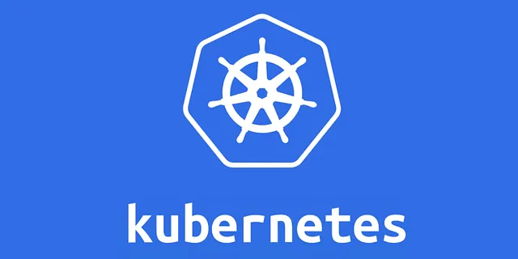

### Blue Green Deployment

* Blue Green is a deployment pattern that reduces downtime by running two identical production environments called blue and green.
* Only one environment lives at a time.
* We beed to ensure about the changes. 
* Changes must be forward and backward-compatible.
* We need to set up a parallel infrastructure i.e. same number of servers and services used in the actual infrastructure. 
* Post the setup deploy the new version to the new infrastructure, do the sanity, and validate everything.
* Then switch all the traffic to the green infrastructure.
* After everything is validate, remove or stop the old infrastructure (blue).
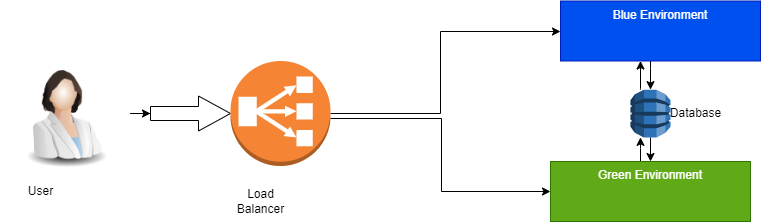

### Prerequisites
* Kubernetes Cluster
* kubectl command-line tool (kubectl)
* Docker image of the application to be deployed.

### Create a namespace
* Run below command to create the namespace
```
kubectl create namespace blue-green-deployment
```
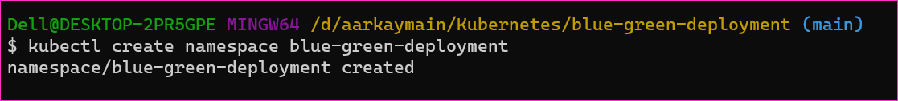

### Create Deployment
* Create a manifest file and add the below code to it for creating the deployment.

```yaml
---
apiVersion: apps/v1
kind: Deployment
metadata:
  name: demoapp-blue
  labels:
    app: demoapp
    env: blue
spec:
  replicas: 3
  selector:
    matchLabels:
      app: demoapp
      env: blue
  template:
    metadata:
      labels:
        app: demoapp
        env: blue
    spec:
      containers:
        - name: demo
          image: demoapp:v1.0
          ports:
            - containerPort: 80            
```

* Save this manifest as blue-deployment.yaml, and create the deployment in the blue environment using the below command.
```
kubectl apply -f blue-deployment.yaml -n blue-green-deployment
```
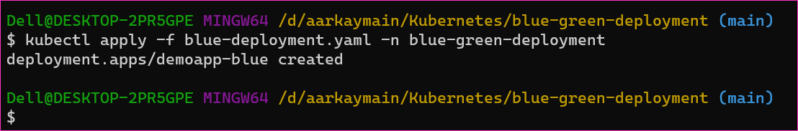

* Similarly, create another deployment for the green environment by changing the name and label in the manifest file, and save it as `green-deployment.yaml`. 

```yaml
---
apiVersion: apps/v1
kind: Deployment
metadata:
  name: demoapp-green
  labels:
    app: demoapp
    env: green
spec:
  replicas: 3
  selector:
    matchLabels:
      app: demoapp
      env: green
  template:
    metadata:
      labels:
        app: demoapp
        env: green
    spec:
      containers:
        - name: demo
          image: demoapp:v1.0
          ports:
            - containerPort: 80
```

* Then, deploy it in the green environment using the command.
```
kubectl apply -f green-deployment.yaml -n blue-green-deployment
```
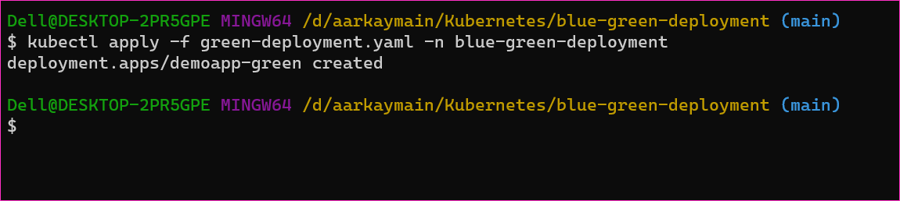

### Create a Service
* Now, we need to create a service that will expose our application to the outside world.
* The service should use the label selector to route traffic to either the blue or green deployment.
* Create a manifest file and add the below code to it.

```yaml
---
apiVersion: v1
kind: Service
metadata:
  name: demoapp-service
spec:
  selector:
    app: demoapp
  ports:
    - name: http
      port: 80
      targetPort: 80
  type: LoadBalancer 
```   

* Save this manifest file as `service.yaml`, and create the service using the below command.
```
kubectl apply -f service.yaml -n blue-green-deployment
```
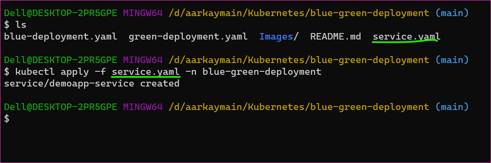

* Now, let's verify that the deployments and service are working correctly.
* To do this, we need to get the external IP address of the service.
```
kubectl get service demoapp-service -n blue-green-deployment
```
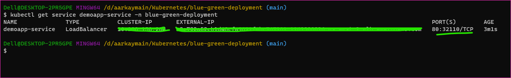


* This command will output the external IP address of the service.
* Use this IP address to access the application in a web browser.
* You should see the application running in the blue environment.

### Perform Blue-Green Deployment
* Now that we have both blue and green deployments running, we can perform the Blue-Green Deployment by routing traffic from the blue deployment to the green deployment.

### Update the Green Deployment
* First, we need to update the green deployment with the new version of the application.
* To do this, update the image field in the green deployment manifest with the new version of the Docker image and save it as `green-deployment-v2.yaml`

```yaml
---
apiVersion: apps/v1
kind: Deployment
metadata:
  name: demoapp-green
  labels:
    app: demoapp
    env: green
spec:
  replicas: 3
  selector:
    matchLabels:
      app: demoapp
      env: green
  template:
    metadata:
      labels:
        app: demoapp
        env: green
    spec:
      containers:
      - name: myapp
        image: myapp:v2.0
        ports:
        - containerPort: 80
```

* Apply the updated green deployment using the following command.
```
kubectl apply -f green-deployment-v2.yaml -n blue-green-deployment
```
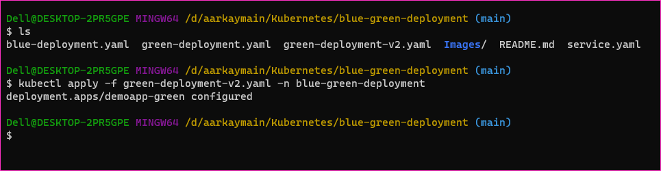


### Update the Service
* Next, we need to update the service to route traffic to the green deployment.
* To do this, update the label selector in the service manifest to select the green deployment.

```yaml
---
apiVersion: v1
kind: Service
metadata:
  name: myapp-service
spec:
  selector:
    app: demoapp
    env: green
  ports:
  - name: http
    port: 80
    targetPort: 80
  type: LoadBalancer
```

* Apply the updated service using the following command.
```
kubectl apply -f service.yaml -n blue-green-deployment
```
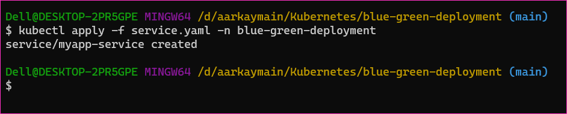


* Finally, we need to verify that the deployment was successful. 
* To do this, get the external IP address fo the service using the `kubectl get service` command as before, and access the application in a web browser.
* You should see the updated version of the application running in the green environment.
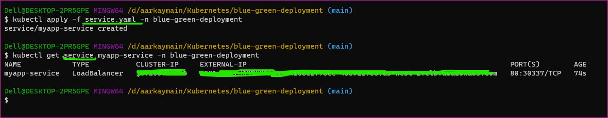


### Rollback
* If something goes wrong during the deployment, we can easily roll back to the previous version of the application by simply updating the label selector in the service manifest to select the blue deployment and reapplying the service manifest.

```yaml
---
apiVersion: v1
kind: Service
metadata:
  name: myapp-service
spec:
  selector:
    app: demoapp
    env: blue
  ports:
  - name: http
    port: 80
    targetPort: 80
  type: LoadBalancer
```

* Apply the updated service using the following command.
```
kubectl apply -f service.yaml -n blue-green-deployment
```
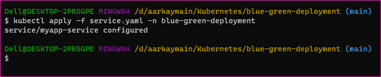


### Considerations
* There are a few other considerations to keep in mind when using Blue-Green Deployment in Kubernetes.
    * Storage: 
        * If your application requires persistent storage, you will need to ensure that both the blue and green deployments are using the same persistent volume.
        * Otherwise, you may lose data during the deployment process.
    * DNS: 
        * If you using a custom domain name for your application, you will need to update the DNS records to point to the new IP address when switching from the blue to the green deployment.
    * Testing:
        * Before switching traffic to the green deployment, it is essential to thoroughly test the new version of the application ls
        * to ensure that it is working correctly.
        * You can use canary deployments to gradually shift traffic to the new version of the application and monitor its performance.
* Additionally, there are a few tools practices that can help simplify Blue-Green Deployment in Kubernetes.
    * Helm:
        * Helm is a package manager for Kubernetes that allows you to deploy and manage applications using charts.
        * Charts are preconfigured templates that can include multiple Kubernetes resources, including deployments, services, and ingress rules.
        * Helm charts can simplify the process of deploying applications using Blue-Green Deployment by providing a standardized way to manage the deployment process.
    * Kubernetes Ingress:
        * Ingress is a Kubernetes resource that provides routing rules for external traffic to access services within a cluster.
        * By using Ingress, you can easily switch traffic from the blue deployment to the green deployment by updating the Ingress rules.
    * Istio:
        * Istio is a service mesh that provides traffic management, security, and observability for microservices running in a Kubernetes cluster.
        * Istio can simplify the process of managing traffic during Blue-Green Deployment by providing canary deployment functionality and traffic shifting rules.

### Conclusion
* While Blue-Green Deployment can be an effective way to deploy applications, it may not be the best choice for every situation.
* For example, if your application requires a lot of data migration or database schema changes, Blue-Green Deployment may not be the best strategy, as it can lead to data inconsistencies between the blue and green environments.
* In addition, Blue-Green Deployment can be challenging to implement for stateful applications that require persistent storage, as the data must be synchronized between the blue and green environments.
* In these cases, you may need to consider other deployment strategies, such as rolling updates or canary deployments.
* In this blog post, we have learned how to perform Blue-Green Deployment using Kubernetes. 
* Blue-Green Deployment is a popular deployment strategy that provides zero downtime and a quick and easy way to roll back if something goes wrong.


### Thank's for Reading!


